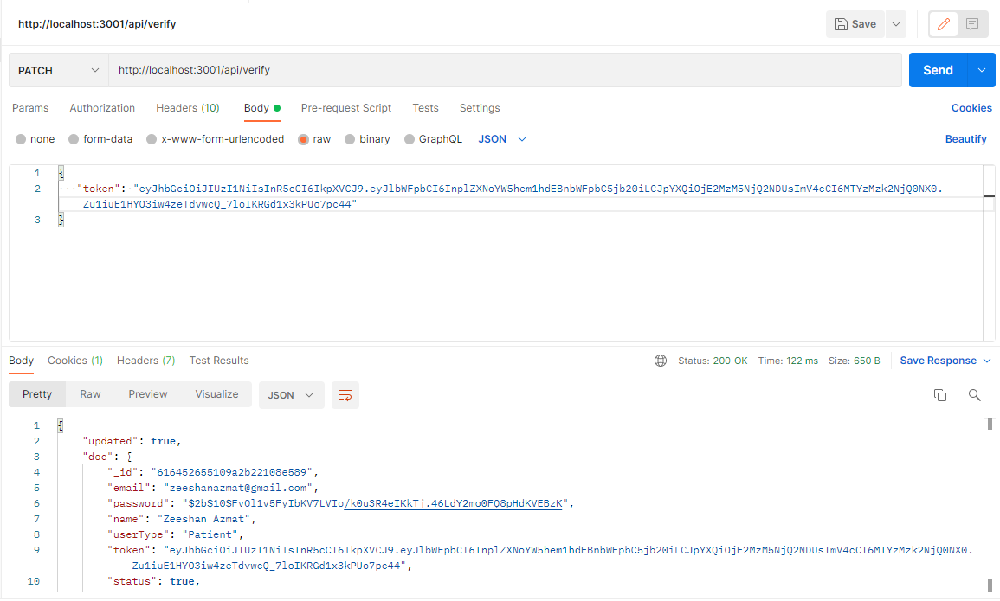
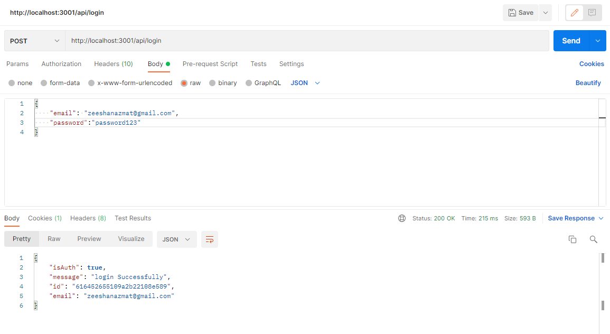
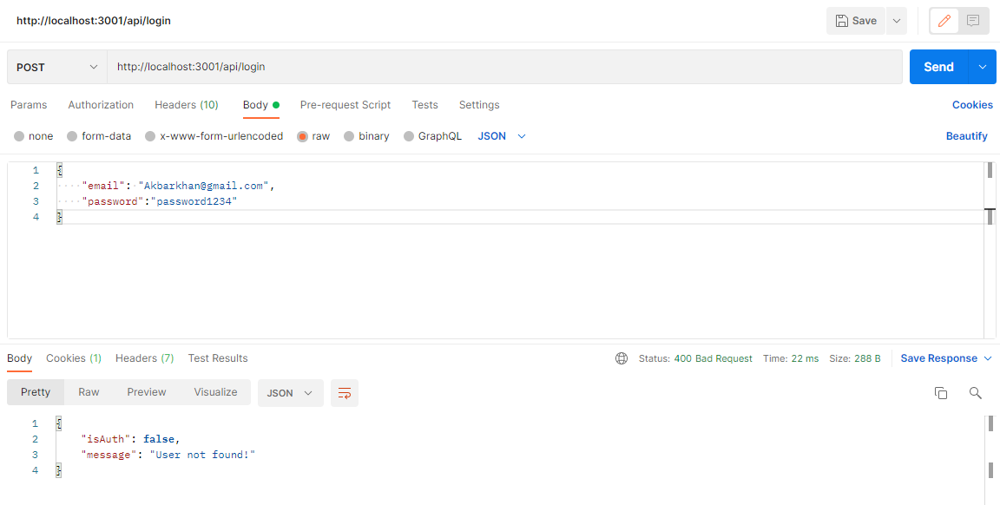
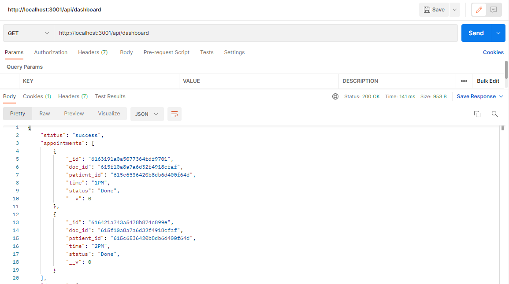
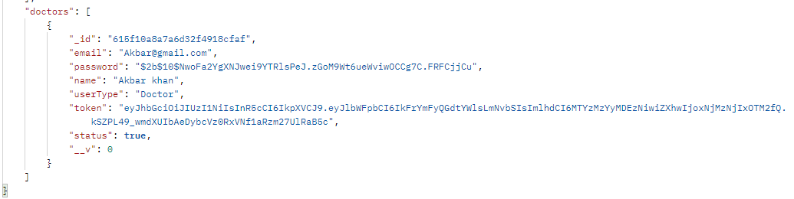
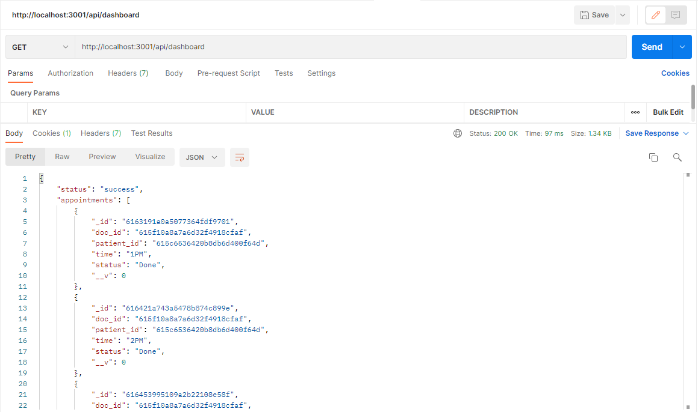
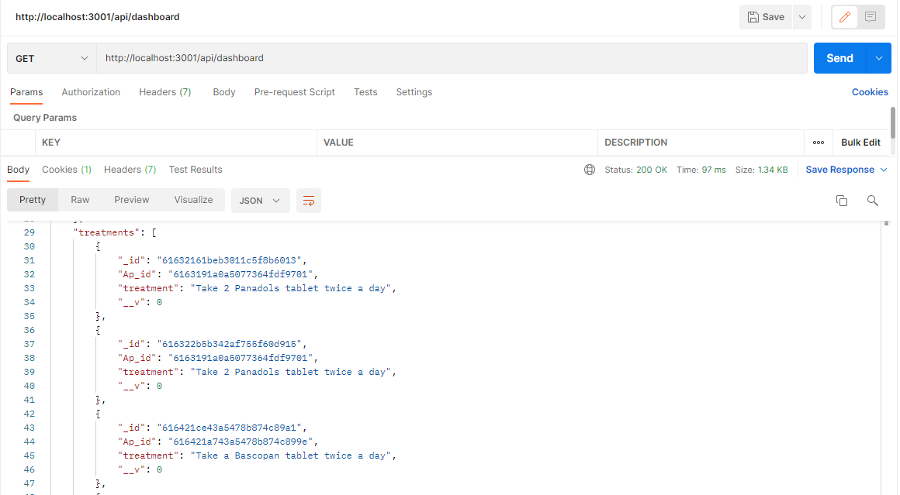
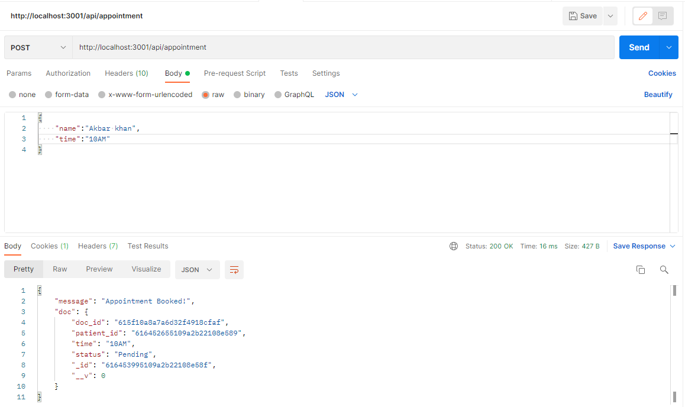
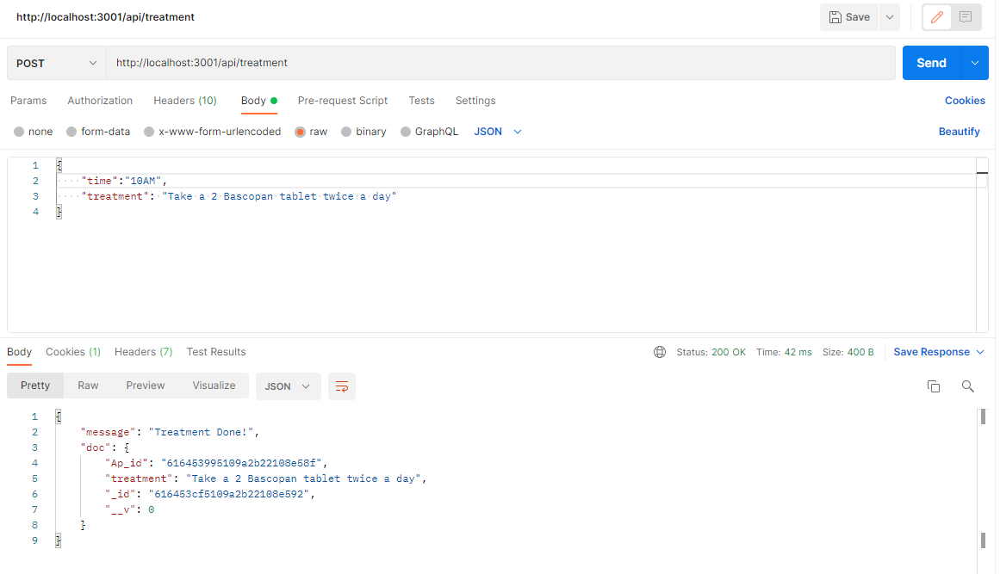

# Metropolis-app
 Blockship Node Assignment
 
 # Postman API Testing ScreenShots
 
 ## User Registration
 

 ## User Email Verification
 

 ## User Login
 

 ## Authentication Failed
 

 ## Dashboard Patient
 
 

 ## Dashboard Doctor
 
 

 ## Doctor Appointment
 

 ## Patient Treatment
 
